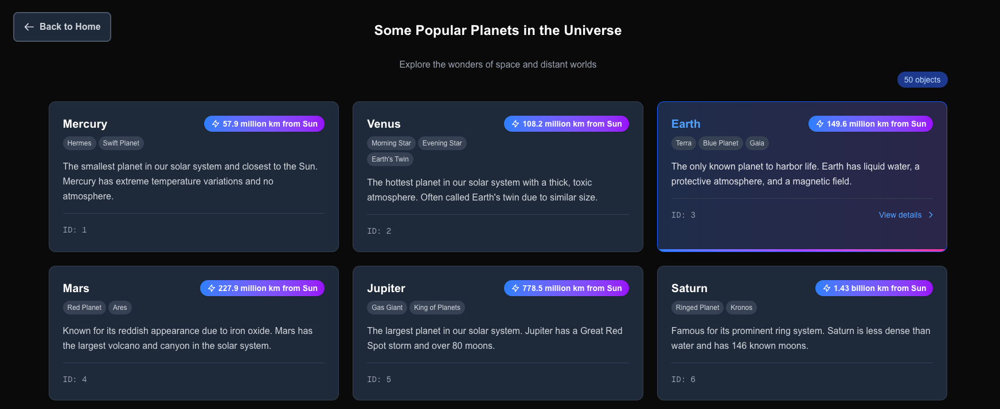

# 🚀 Server-Side use() Hook Demonstration



## 🛠️ Installation & Setup

### 📦 Prerequisites
- **Node.js** - v18 or higher
- **pnpm** - is recommended
- **Next.js 15** - canary version (15.0.0-canary.10) to enable dynamicIO
- **React 19** - With the new `use()` hook
- **TypeScript** - For type safety
- **Tailwind CSS** - For styling
- **JSON Server** - Mock API for demonstration

### 🏗️ Installation Steps

1. **Clone the repository**
   ```bash
   git clone <repository-url>
   cd next-use-hook
   ```

2. **Install dependencies**
   ```bash
   pnpm install
   # or
   npm install
   ```

3. **Start the mock API server**
   ```bash
   pnpm run mock-api
   # or
   npm run mock-api
   ```
   This will start the JSON server on `http://localhost:3001`

   Now, open another console and start the development server.

4. **Start the development server**
   ```bash
   pnpm dev
   # or
   npm run dev
   ```
   Open [http://localhost:3000](http://localhost:3000) with your browser to see the result.

## 🎯 What This Demo Demonstrates

This demo showcases how the `use()` hook works on the server side with Next.js App Router. Pay attention to the **DevTools Network tab** - you'll notice there are no API calls after the initial page render.

When you click a button, the data is fetched and the page is rendered entirely on the server side. You'll see a **2-second artificial delay** before the whole page is ready, simulating real-world data fetching.

### 🔑 Key Point

The `use()` hook does **NOT block** the initial page rendering. While data is being prepared on the server, the loading state is presented immediately, providing a smooth user experience.

This demonstrates React's concurrent features working seamlessly with Next.js server components, allowing for progressive enhancement and better perceived performance.

---

## 🔄 React 18+ use() RSC vs Next 15 Server Actions

A version switcher button is available at the top of the app to toggle between the two approaches:

| Version | Route | Description |
|---------|-------|-------------|
| **React 18+ use() RSC** | `/` | Uses the new React 18+ `use()` hook for server components and data fetching. Demonstrates RSC and concurrent features. |
| **Next 15 Server Actions** | `/next` | Uses Next.js 15's Server Actions and conventions for data fetching and navigation. |

- The UI and data are similar, but the underlying data fetching and rendering approach is different.
- Use the switcher to compare the developer and user experience between the two methods.

---

## 📁 Project Structure

```
├── app/                    # Next.js App Router pages
├── components/            # Reusable React components
├── mock-data/            # JSON server data
├── types/                # TypeScript type definitions
└── util/                 # Utility functions
```

## 🎮 How to Test

1. Open the application in your browser
2. Open DevTools and go to the Network tab
3. Click on either "🪐 Planets" or "✨ Star Systems" button
4. Observe:
   - No client-side API calls in the Network tab
   - Loading state appears immediately
   - Page renders after 2-second delay (server-side)
   - Smooth user experience despite the delay
